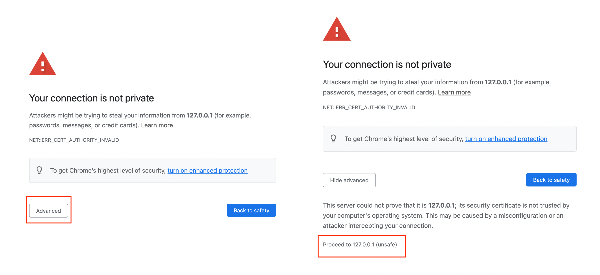
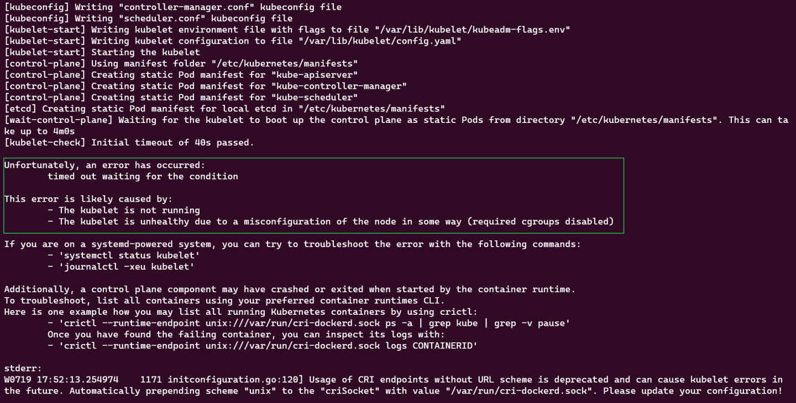
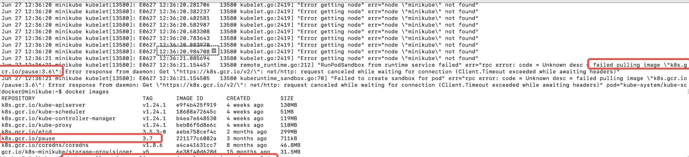

# Introduction 

There are several topics we intend to cover in this series:
- Installation and setup 
- Using dflow to write a simple workflow 
    - [dflow-python.ipynb](https://github.com/deepmodeling/dflow/blob/master/tutorials/dflow-python.ipynb)
    - [dflow-function.ipynb](https://github.com/deepmodeling/dflow/blob/master/tutorials/dflow-function.ipynb)
- Advanced functionality of dflow
    - running jobs in parallel: [dflow-slices.ipynb](https://github.com/deepmodeling/dflow/blob/master/tutorials/dflow-slices.ipynb)
    - writing while loop in dflow: [dflow-recurse.ipynb](https://github.com/deepmodeling/dflow/blob/master/tutorials/dflow-recurse.ipynb)
    - reusing operated nodes: [dflow-reuse.ipynb](https://github.com/deepmodeling/dflow/blob/master/tutorials/dflow-reuse.ipynb)
    - complex condition: [dflow-conditional.ipynb](https://github.com/deepmodeling/dflow/blob/master/tutorials/dflow-conditional.ipynb)
- Using dflow to submit job to slurm cluster
    - [dflow-slurm.ipynb](https://github.com/deepmodeling/dflow/blob/master/tutorials/dflow-slurm.ipynb)

# Installation and setup
**!!!Install and setup the dflow environment on your PC!!!**
**!!!DO NOT install on the login node of the HPC cluster!!!**
## Installation
We need to install three dependencies to use dflow:
- Container engine: [Docker](https://www.docker.com/)([知乎介绍](https://zhuanlan.zhihu.com/p/23599229))
- Kubernetes: [minikube](https://minikube.sigs.k8s.io/docs/)([知乎介绍](https://zhuanlan.zhihu.com/p/112755080))
- dflow: [pydflow](https://pypi.org/project/pydflow/)

### Easy Install
You can use the installation script to install all server and setup in one step. If you choose to use this method, you can skip all the installation and setup process. 
#### IP-address outside China
- MacOS: https://github.com/deepmodeling/dflow/blob/master/scripts/install-mac.sh
- WindowsOS: Coming Soon. [Submit your installation script here.](https://github.com/deepmodeling/dflow/issues/36)
- On Linux: https://github.com/deepmodeling/dflow/blob/master/scripts/install-linux.sh

#### IP-address inside China
- MacOS: https://github.com/deepmodeling/dflow/blob/master/scripts/install-mac-cn.sh
- WindowsOS: Coming Soon. [Submit your installation script here.](https://github.com/deepmodeling/dflow/issues/36)
- On Linux: https://github.com/deepmodeling/dflow/blob/master/scripts/install-linux-cn.sh

### Install Manually

#### Server 
##### Container engine
- Docker installation is very easy. Check out its official installation guide: [Get Docker](https://docs.docker.com/get-docker/)

##### Kubernetes
- If you are setting up Kubernetes on your own laptop, you can install minikube. Checkout its official installation guide: [minikube start](https://minikube.sigs.k8s.io/docs/start/)

##### Step-by-step installation guide 
- [Install on MacOS](./install_manual_macos.md)
- [Install on WindowsOS](./install_manual_windowsos.md)
- [Install on LinuxOS](./install_manual_linuxos.md)

#### Pydflow 
After you have installed the first two dependencies, you can install dflow using pip. 
```bash
pip install pydflow
```

## Setup 
### Minikube
dflow runs on Kubernetes (k8s), so we need to start minikube
```bash
minikube start
```
### Start minikube in China
To speed up the startup, we can use the image repository setup on aliyun. To start minikube,
```bash
minikube start --image-mirror-country=cn
```

### Argo
dflow is built on [argo-workflow](https://github.com/argoproj/argo-workflows), so we need to setup argo engine in Kubernetes or minikube.

#### Install Argo with IP address outside China 
To get started quickly, we can use the quick start manifest which will install Argo Workflows as well as some commonly used components:
```bash
kubectl create ns argo
kubectl apply -n argo -f https://raw.githubusercontent.com/deepmodeling/dflow/master/manifests/quick-start-postgres.yaml
```
#### Install Argo with IP address inside China
Although you can still use the above method to install Argo, it might lead to a very long wait. To speed up the installation process, you can use another YAML file.
```bash
# download the YAML file to local
wget https://raw.githubusercontent.com/deepmodeling/dflow/master/manifests/quick-start-postgres-stable-cn.yaml 
kubectl apply -n argo -f quick-start-postgres-stable-cn.yaml
# linux user might need to use `minikube kubectl --`
```

#### Monitor the install and setup progress
To monitor the setup progress, we can checkout the pod status.
```bash
kubectl get pod -n argo
# linux user might need to use `minikube kubectl --`
```

**NOTE!!!!**: This process might take a while, depending on the internet speed. Wait and keep refreshing the above cell. Once the `STATUS` of all pods is `RUNNING`, you can proceed with the next step.

### Port-forward Argo UI and Minio API
#### Access the Argo UI: 

**!!!!IMPORTANT!!!!** Since we need to keep this UI running, we have to keep this command running. 
    
```bash
kubectl -n argo port-forward deployment/argo-server 2746:2746 --address 0.0.0.0
# linux user might need to use `minikube kubectl --`
```

You can log in the Argo UI via this address: https://127.0.0.1:2746. Please ignore the security warning. 
<p align="center">

</p>

#### Access the minio API: 

**!!!!IMPORTANT!!!!** Open another terminal and run this, because you want to keep artifact respository running. Note that you don't need to ingress the artifact repository if you are not downloading or uploading artifact.

```bash
kubectl -n argo port-forward deployment/minio 9000:9000 --address 0.0.0.0
# linux user might need to use `minikube kubectl --`
```

#### **[BONUS]** Access minio UI
```bash
kubectl -n argo port-forward deployment/minio 9001:9001 --address 0.0.0.0
# linux user might need to use `minikube kubectl --`
```
You can log in the Argo UI via this address: http://127.0.0.1:9001. 
The default login credentials is:
- admin: admin
- password: password

<p align="center"> <strong> That's it! You've finished the installation and setup. </strong></p> 

# FAQ
**1. minikube start failure**
- Problem Description: After `minikube start`, you probably saw this message:
<p align="center">

</p>

- Bug source: 

    - One common reason is that minikube starts with incorrect images. We can see the details of the log using the following command
    ```bash
    minikube ssh #enter minikube node 
    sudo journalctl -xeu kubelet
    ```
<p align="center">

</p>
NOTE: minikube needs `k8s.gcr.io/pause:3.6`, but it pulled `k8s.gcr.io/pause:3.7'. So it will not start.

- Solutions: 
    - (Recommended) Enter minikube environment and pull the image manually.
    ```bash 
    minikube ssh
    docker pull registry.aliyuncs.com/google_containers/pause:3.6
    docker tag registry.aliyuncs.com/google_containers/pause:3.6 k8s.gcr.io/pause:3.6
    exit
    ```
    - Downgrade minikube version: you can download older version in this page: [Releases · kubernetes/minikube](https://github.com/kubernetes/minikube/releases)